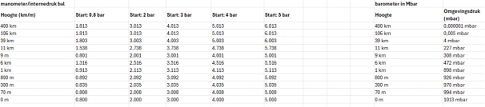

**Aandachtspunt 1 | het scrol systeem en de behavior**

Op de meegeleverde afbeelding zie je verschillende onderdelen getoond staan dit zijn allemaal losse elementen:

·       Voetbal

·       Barometer (+ getal boven op de Barometer) (laat omgevingsdruk zien).

·       Manometer (+ getal boven op de Manometer) (laat interne druk van de voetbal zien).

·       Pomp

·       Herkenningspunt gebaseerd op een afbeelding op basis van de hoogte (x 11)

·       Hoogtemeter (getal).

·       Achtergrond van 11880 px hoog x 1920 px breed.

De Achtergrond is 11880 px hoog en1920 px breed, maak de achtergronden afbeelding zo breed. (Weergave is van de browser16:9), wat betekend is dat je moet scrollen.

Bij het scrollen veranderd de hoogtepunt in Meter of Kilometers (hoogte).

De hoogte punt start vanaf het begint punt, 0 m tot aan 400 km. (Achtergrond afbeelding start onderaan).

De sprongen tussen iedere stap wordt steeds groter (zie lijst/tabel – meegeleverde getallen).

De barometer past zich aan de hoogte meter (zie lijst/tabel – meegeleverde getallen)

De aangegeven punten (hoogte punten) zijn daarbij ook magnetische punten, wat bedoel ik hiermee:

Als je stopt met scrollen dat wordt je automatisch gebracht naar de dichtstbijzijnde aangegeven hoogtepunt.

(Stel: je stopt op 85 meter, wordt je automatisch gebracht naar de dichtstbijzijnde punt, in dit geval 70 meter).

Bij iedere hoogtepunt (zie lijstje/tabel – meegeleverde getallen) komt er vanuit de linkerkant een afbeelding ingeschoven. Dus als je scrolt voorbij z’n punt of terecht komt op z’n punt veranderd de afbeelding naar de toebehorende hoogte punt.

Stapsgewijs:

1.         Je komt op 70 meter

2.         De afbeelding die hoort bij zee niveau veranderd schuift naar rechts uit het scherm.

3.         De volgende afbeelding die hoort bij 70 meter schuift vanuit de rechterkant weer in het scherm op dezelfde positie.

De achtergrond afbeelding is 11.880 pixels hoog, wat je als het ware kunt opdelen in 11 stukken van 1080 px hoog. De hoogtepunten sluiten op centrale punt van de 1080 px. Wat inhoud bij eerste hoogte punt valt op 540 px.

·       2de hoogte punt valt op 1620px hoog

·       3de hoogte punt valt op 2700px hoog

·       4de hoogte punt valt op 3780 px hoog

·       Ect.

Dus iedere hoogte punt zie lijst/tabel sluit op het centrale punt van iedere 1080px en dat \* 11.

Conclusie:

·       Op basis van het scrollen veranderd de hoogte startend bij 0m tot aan 400 km (zie lijst/tabel – meegeleverde getallen voor de volledige lijst)

·       Het getal dat getoond word in de barometer veranderd aan de hoogte. (Zie lijst/tabel – meegeleverde getallen welke getallen bij welke hoogtes horen)

·       Iedere hoogtepunt (zie lijst/tabel– meegeleverde getallen) is een magnetisch punt. Als je stopt met scrollen dan scrol je automatisch door tot aan de aangegeven punt (de hoogtepunt). Zie lijst/tabel welke punten dit moet wezen.

·       Iedere hoogte punt staat centraal op 1080 px, wat neerkomt op 540px. De afbeelding blijft 11.880 hoog en kun je als het ware opdelen in 11 stukken van 1080px. 

**Punt 2 | animatie van de bal**

Nadat de hoogte punt is bepaald (je stop met scrollen of je wordt automatisch daar naar toe gebracht) kun je de bal oppompen. De bal is in het begint altijd leeg. De bal heeft 6 stadia van leeg tot vol. (0 - 5 bar).

·       0

·       0.8

·       2

·       3

·       4

·       5

De bal kun je oppompen met een fietspomp. Bij 6 keer klikken op de pomp, blaas je de bal helemaal vol. Dus iedere keer klikken blaas de bal een beetje op, en veranderd dus de afbeelding in een nieuwe stadia (de bal (de afbeelding van de bal) veranderd dus bij iedere klik).

**Punt 3 | Manometer en hoogte**

De manometer veranderd bij de toebehorende getallen zie lijst/tabel – meegeleverde getallen.

De getal van de manometer waar de interne druk van de bal wordt weergeven. Dit stijgt op naarmate je op de fietspomp drukt. 0 – 5 bar.

De manometer veranderd aan de hoogte punt met de bijhorende getal (zie lijst/tabel – meegeleverde getallen).

**Punt 5 eindscherm**

Nadat je succesvol of niet, de bal hebt opgepompt komt er een overlay die uitlegt geeft over de oorzaak en waarom er iets is gebeurt. Als de interne druk van de bal hoger is dan 5 bar, wordt er een video bij getoond die laat zien wat er gebeurt als je boven de 5 bar komt.

Onder de info en/of video komt een button die het reset, waarbij je opnieuw kunt beginnen.